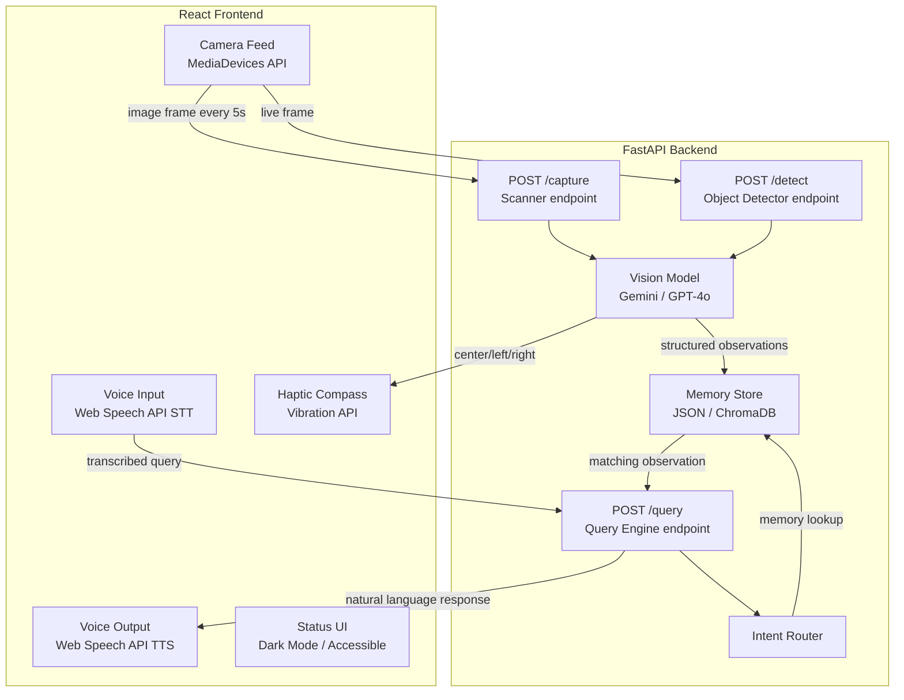

# Design Document: Retina Memory

## Overview

Retina Memory is an AI-powered assistive application for blind and visually impaired users. The system passively scans the user's environment via the device camera, builds a time-stamped memory of object locations using a cloud vision LLM, and allows users to query that memory through voice to locate misplaced items. A haptic compass feature guides users toward a target object by vibrating when the camera is pointed at the object's last known position.

### Design Goals

- **Accessibility-first**: Every interaction must be operable without sight — voice in, audio out, haptic feedback.
- **Passive operation**: Scanning runs silently in the background with no required user interaction.
- **Privacy by design**: No raw images are persisted; only structured observations. No data leaves the device except for LLM inference calls.
- **Resilience**: The system degrades gracefully when the LLM is unavailable, the camera is inaccessible, or the device battery is low.
- **Testability**: Core logic (parsing, memory management, query routing, haptic logic) is implemented as pure functions to enable property-based testing.

### Technology Stack

| Layer | Technology |
|---|---|
| Frontend | React (Vite), Web Speech API, MediaDevices API, Vibration API |
| Backend | Python FastAPI |
| Vision AI | Google Gemini 1.5 Flash / OpenAI GPT-4o (configurable); dummy fallback |
| Memory Store | JSON file (default) or ChromaDB (optional vector store) |
| Speech-to-Text | Web Speech API (browser-native) or Faster-Whisper (backend) |
| Text-to-Speech | Web Speech API SpeechSynthesis |

---

## Architecture

The system follows a client-server architecture. The React frontend handles all real-time sensor interactions (camera, microphone, vibration, audio output) and delegates AI inference and memory management to the FastAPI backend.



### Request Flow: Passive Scanning

1. Frontend timer fires every 5 seconds (or 30 s in low-battery mode).
2. Frontend captures a JPEG frame from the `<video>` element via `<canvas>`.
3. Frame is base64-encoded and POSTed to `POST /capture`.
4. Backend sends the image to the Vision Model with the structured prompt.
5. Vision Model returns a JSON array of observations.
6. Backend parses, validates, and writes each observation to the Memory Store.
7. Backend returns the parsed observations to the frontend for the "last detected objects" list.

### Request Flow: Voice Query

1. Wake word detected (or mic button pressed) → Web Speech API begins transcription.
2. Transcribed text is POSTed to `POST /query`.
3. Backend Intent Router classifies the query.
4. For memory lookups: Memory Store is searched; most recent matching observation is returned.
5. Backend generates a natural language response string.
6. Frontend speaks the response via `SpeechSynthesis`.

### Request Flow: Haptic Compass

1. User requests haptic guidance for a named object.
2. Frontend begins sending live frames to `POST /detect` at ~10 fps.
3. Backend returns the detected position (`left`, `center`, `right`, or `not_found`).
4. Frontend triggers `navigator.vibrate()` only when position is `center`.
5. If device does not support vibration, a visual indicator pulses instead.

---

## Components and Interfaces

### Frontend Components

#### `App.jsx` — Root Component

Manages global state: active mode (`scanning`, `listening`, `thinking`), last detected objects list, haptic guidance target, and TTS queue.

#### `CameraFeed.jsx`

- Renders a `<video>` element with `getUserMedia` stream.
- Exposes a `captureFrame(): Blob` method used by the scanner timer.
- Displays a live preview (optional, can be hidden for privacy).

#### `VoiceInput.jsx`

- Wraps `window.SpeechRecognition` / `webkitSpeechRecognition`.
- Emits `onTranscript(text: string)` when recognition completes.
- Falls back to a `<textarea>` text input when speech recognition is unavailable.

#### `VoiceOutput.jsx` (utility module)

- Wraps `window.speechSynthesis.speak()`.
- Queues utterances; does not interrupt a speaking response.
- Respects the configured speech rate (0.5×–2.0×).

#### `StatusIndicator.jsx`

- Displays current mode: **Scanning** / **Listening** / **Thinking**.
- Uses large, high-contrast text and an animated icon.
- Announces mode changes via `aria-live` region for screen reader compatibility.

#### `HapticCompass.jsx`

- Manages the haptic guidance session state.
- Sends frames to `/detect` and calls `navigator.vibrate(150)` on `center` detections.
- Falls back to a pulsing visual indicator (`<div>` with CSS animation) when `navigator.vibrate` is unavailable.

#### `ObjectList.jsx`

- Renders the last N detected objects with name, position, and relative timestamp.
- Items are large, high-contrast, and screen-reader accessible.

#### `ScanButton.jsx`

- "Scan Now" button that triggers an immediate capture outside the timer cycle.
- Accessible: large touch target (min 48×48 px), `aria-label` set.

#### `DemoMode.jsx`

- Loads sample images and pre-seeded memory entries.
- Allows testing the full UI flow without a real camera or LLM.

### Backend Modules

#### `main.py` — FastAPI Application Entry Point

Registers routers, configures CORS, and initialises the Memory Store on startup.

#### `api.py` — Route Handlers

Defines the three API endpoints. Each handler validates the request, delegates to the appropriate service module, and returns a structured response.

#### `vision.py` — Vision Model Client

```python
async def analyze_image(image_bytes: bytes) -> list[Observation]:
    """Send image to LLM and return parsed observations."""
```

- Supports Gemini and GPT-4o via a common interface.
- Falls back to a `DummyVisionClient` that returns a fixed set of observations when `VISION_PROVIDER=dummy`.
- Enforces a 10-second timeout; raises `VisionTimeoutError` on expiry.

#### `memory.py` — Memory Store

```python
def write_observations(observations: list[Observation]) -> None: ...
def query_observations(object_name: str) -> Observation | None: ...
def clear_all() -> None: ...
def get_recent(limit: int = 20) -> list[Observation]: ...
```

- Default implementation: append-only JSON file with a circular buffer capped at 100 entries.
- Optional ChromaDB implementation behind a `MEMORY_BACKEND` environment variable.
- All writes are atomic (write to temp file, rename).

#### `intent.py` — Intent Router

```python
def classify_intent(query: str) -> Literal["memory_lookup", "live_vision"]:
    """Classify a transcribed query by keyword matching."""
```

- Pure function: no I/O, no side effects.
- Memory lookup keywords: `where did i leave`, `where is my`, `have you seen my`, `find my`, `where are my`.
- Live vision keywords: `what is this`, `what am i holding`, `describe`, `what do you see`.
- Defaults to `memory_lookup` for unmatched queries.

#### `response.py` — Natural Language Response Generator

```python
def format_memory_response(observation: Observation | None, object_name: str) -> str:
    """Generate a spoken response from a memory query result."""
```

- Pure function.
- Found: `"I last saw your {object} {relative_time} {position_phrase}."`
- Not found: `"I couldn't find your {object} recently. I haven't seen it in the last 24 hours."`

#### `db.py` — Storage Abstraction

Provides the `MemoryStore` abstract base class and concrete `JSONMemoryStore` and `ChromaMemoryStore` implementations.

---

## Data Models

### `Observation` (shared between frontend and backend)

```typescript
// TypeScript (frontend)
interface Observation {
  object: string;          // e.g. "wallet"
  color: string;           // e.g. "brown"
  position: "left" | "center" | "right";
  location: string;        // e.g. "on the table near the door"
  timestamp: string;       // ISO 8601, e.g. "2024-01-15T14:32:00Z"
  confidence?: number;     // 0.0–1.0, optional
}
```

```python
# Python (backend)
from pydantic import BaseModel
from datetime import datetime
from typing import Literal

class Observation(BaseModel):
    object: str
    color: str
    position: Literal["left", "center", "right"]
    location: str
    timestamp: datetime
    confidence: float | None = None
```

### Memory Store Schema (JSON file)

```json
{
  "version": 1,
  "entries": [
    {
      "object": "wallet",
      "color": "brown",
      "position": "center",
      "location": "on the side table near the door",
      "timestamp": "2024-01-15T14:32:00Z",
      "confidence": 0.92
    }
  ]
}
```

The `entries` array is a circular buffer. When the entry count exceeds `MAX_ENTRIES` (default: 100), the oldest entry is removed before inserting the new one.

### API Request / Response Schemas

#### `POST /capture`

```typescript
// Request
interface CaptureRequest {
  image: string;  // base64-encoded JPEG
}

// Response
interface CaptureResponse {
  observations: Observation[];
  model_used: string;
  processing_time_ms: number;
}
```

#### `POST /query`

```typescript
// Request
interface QueryRequest {
  query: string;  // transcribed user query
}

// Response
interface QueryResponse {
  intent: "memory_lookup" | "live_vision";
  response_text: string;   // spoken response
  observation: Observation | null;
}
```

#### `POST /detect`

```typescript
// Request
interface DetectRequest {
  image: string;       // base64-encoded JPEG
  target_object: string;
}

// Response
interface DetectResponse {
  position: "left" | "center" | "right" | "not_found";
  confidence: number;
}
```

### Vision Model Prompt

```
You are an intelligent vision assistant for a blind user. Analyze the image and return ONLY a JSON array of important visible objects. For each object include:
- "object": the object name (lowercase string)
- "color": the primary color (lowercase string)
- "position": one of "left", "center", or "right" (relative to the image frame)
- "location": a brief natural language description of where the object is (e.g., "on the table", "near the door")
- "confidence": a float between 0.0 and 1.0

Return STRICT JSON only. No markdown, no explanation. Example:
[{"object":"wallet","color":"brown","position":"center","location":"on the side table","confidence":0.92}]
```

### Intent Classification Rules

| Pattern (case-insensitive) | Classification |
|---|---|
| `where did i leave`, `where is my`, `have you seen my`, `find my`, `where are my` | `memory_lookup` |
| `what is this`, `what am i holding`, `describe`, `what do you see`, `what's in front` | `live_vision` |
| *(no match)* | `memory_lookup` (default) |

---

## Correctness Properties

*A property is a characteristic or behavior that should hold true across all valid executions of a system — essentially, a formal statement about what the system should do. Properties serve as the bridge between human-readable specifications and machine-verifiable correctness guarantees.*

### Property 1: Observation Round-Trip Fidelity

*For any* valid Observation written to the Memory Store, querying the store by the same object name and timestamp SHALL return an Observation with identical field values (object, color, position, location, timestamp).

**Validates: Requirements 2.6**

---

### Property 2: Circular Buffer Capacity Invariant

*For any* sequence of N write operations to the Memory Store where N > MAX_ENTRIES, the store SHALL contain exactly MAX_ENTRIES entries after all writes complete, and the retained entries SHALL be the N most recently written.

**Validates: Requirements 2.4, 2.5**

---

### Property 3: Malformed LLM Response Rejection

*For any* string that is not a valid JSON array of Observations (missing required fields, wrong types, invalid position enum), the parser SHALL reject it and return an empty list without raising an unhandled exception.

**Validates: Requirements 2.3**

---

### Property 4: Intent Classification Totality

*For any* non-empty string query, the Intent Router SHALL return exactly one of `"memory_lookup"` or `"live_vision"` — never `null`, never an exception.

**Validates: Requirements 6.4**

---

### Property 5: Memory Lookup Keywords Always Route to Memory

*For any* query string that contains at least one memory-lookup keyword phrase (e.g., "where is my", "where did I leave"), the Intent Router SHALL classify it as `"memory_lookup"` regardless of other content in the string.

**Validates: Requirements 6.1**

---

### Property 6: Live Vision Keywords Always Route to Live Vision

*For any* query string that contains at least one live-vision keyword phrase (e.g., "what is this", "describe what you see") and no memory-lookup keywords, the Intent Router SHALL classify it as `"live_vision"`.

**Validates: Requirements 6.2**

---

### Property 7: Natural Language Response Completeness

*For any* found Observation, the formatted response string SHALL contain the object name, a human-readable relative time expression, and a position or location phrase — and SHALL NOT be empty.

**Validates: Requirements 3.4**

---

### Property 8: Not-Found Response Is Non-Empty and Informative

*For any* object name for which no Observation exists in the Memory Store, the formatted response string SHALL be non-empty and SHALL contain the queried object name.

**Validates: Requirements 3.5**

---

### Property 9: Haptic Trigger Only on Center Detection

*For any* sequence of detection results, the haptic pulse SHALL be triggered if and only if the position is `"center"`. For `"left"`, `"right"`, and `"not_found"` positions, no vibration SHALL be triggered.

**Validates: Requirements 4.3**

---

### Property 10: Observation Serialization Round-Trip

*For any* valid Observation object, serializing it to JSON and deserializing it back SHALL produce an Observation with identical field values.

**Validates: Requirements 2.1, 7.2**

---

## Error Handling

### Vision Model Failures

| Failure | Handling |
|---|---|
| HTTP error / network timeout (>10 s) | Discard frame, log error, resume on next interval |
| Malformed JSON response | Log response, discard, do not write partial observation |
| Rate limit (429) | Exponential backoff: 2 s, 4 s, 8 s; skip frames during backoff |
| Invalid position enum value | Clamp to nearest valid value or discard observation |

### Camera Failures

| Failure | Handling |
|---|---|
| `getUserMedia` permission denied | Log error, suspend scanner, speak "Camera permission required" |
| Camera disconnected mid-session | Catch `MediaStreamTrack.onended`, suspend scanner, notify user |
| Frame capture returns blank image | Detect via pixel variance check; skip frame |

### Memory Store Failures

| Failure | Handling |
|---|---|
| JSON file corrupted | Attempt recovery from backup; if unrecoverable, reinitialise empty store |
| Disk full | Log error, skip write, notify user via TTS |
| Concurrent write conflict | Use file-level lock (Python `fcntl` / `msvcrt`) |

### Voice Pipeline Failures

| Failure | Handling |
|---|---|
| STT not available | Fall back to text input field |
| TTS not available | Display response text visually |
| Wake word false positive | Voice input times out after 5 s of silence, returns to listening |
| Query produces no intent match | Default to `memory_lookup`, announce interpretation |

### Battery Conservation

When `navigator.getBattery()` reports level ≤ 0.15 (15%), the frontend increases the capture interval from 5 s to 30 s and notifies the user once via TTS.

---

## Testing Strategy

### Unit Tests

Unit tests cover specific examples, edge cases, and error conditions for pure functions and isolated modules.

**Backend (pytest)**:
- `test_intent.py`: Verify classification of known memory-lookup and live-vision phrases; verify default fallback for unrecognised queries.
- `test_response.py`: Verify response strings for found/not-found cases with concrete observation fixtures.
- `test_memory.py`: Verify circular buffer eviction, write/read round-trip, clear operation.
- `test_vision_parser.py`: Verify parsing of valid LLM responses; verify rejection of malformed responses (missing fields, wrong types, invalid enums).

**Frontend (Vitest + Testing Library)**:
- `App.test.jsx`: Verify status indicator transitions between modes.
- `HapticCompass.test.jsx`: Verify vibration is called only on `center` detection; verify visual fallback when Vibration API is absent.
- `VoiceOutput.test.jsx`: Verify utterances are queued and not interrupted.

### Property-Based Tests

Property-based tests use **Hypothesis** (Python) for backend logic and **fast-check** (TypeScript) for frontend logic. Each test runs a minimum of **100 iterations**.

**Backend property tests (Hypothesis)**:

```python
# Feature: retina-memory, Property 1: Observation round-trip fidelity
@given(observation_strategy())
@settings(max_examples=100)
def test_observation_round_trip(obs):
    store = JSONMemoryStore(tmp_path)
    store.write([obs])
    result = store.query(obs.object, obs.timestamp)
    assert result == obs
```

```python
# Feature: retina-memory, Property 2: Circular buffer capacity invariant
@given(st.lists(observation_strategy(), min_size=101, max_size=200))
@settings(max_examples=100)
def test_circular_buffer_capacity(observations):
    store = JSONMemoryStore(tmp_path, max_entries=100)
    for obs in observations:
        store.write([obs])
    assert len(store.get_all()) == 100
    assert store.get_all() == observations[-100:]
```

```python
# Feature: retina-memory, Property 3: Malformed response rejection
@given(st.text())
@settings(max_examples=100)
def test_malformed_response_rejected(raw_text):
    result = parse_vision_response(raw_text)
    assert isinstance(result, list)
    # If it parsed, every item must be a valid Observation
    for item in result:
        assert isinstance(item, Observation)
```

```python
# Feature: retina-memory, Property 4: Intent classification totality
@given(st.text(min_size=1))
@settings(max_examples=100)
def test_intent_totality(query):
    result = classify_intent(query)
    assert result in ("memory_lookup", "live_vision")
```

```python
# Feature: retina-memory, Property 10: Observation serialization round-trip
@given(observation_strategy())
@settings(max_examples=100)
def test_observation_serialization_round_trip(obs):
    serialized = obs.model_dump_json()
    deserialized = Observation.model_validate_json(serialized)
    assert deserialized == obs
```

**Frontend property tests (fast-check)**:

```typescript
// Feature: retina-memory, Property 9: Haptic trigger only on center
fc.assert(fc.property(
  fc.constantFrom("left", "center", "right", "not_found"),
  (position) => {
    const vibrateCalled = simulateDetection(position);
    return (position === "center") === vibrateCalled;
  }
), { numRuns: 100 });
```

```typescript
// Feature: retina-memory, Property 7: Response completeness
fc.assert(fc.property(
  arbitraryObservation(),
  (obs) => {
    const response = formatMemoryResponse(obs, obs.object);
    return response.length > 0
      && response.includes(obs.object)
      && containsTimeExpression(response);
  }
), { numRuns: 100 });
```

### Integration Tests

- `test_api_capture.py`: POST a real (or fixture) image to `/capture`; verify response shape and that observations are written to the store.
- `test_api_query.py`: Seed the store, POST a query, verify the response text contains the expected object name.
- `test_api_detect.py`: POST a fixture image to `/detect`; verify position is one of the valid enum values.

### Demo / Test Mode

The frontend `DemoMode` component loads a set of pre-seeded observations and sample images, allowing end-to-end UI testing without a real camera or LLM API key. Activated via `?demo=true` query parameter or the "Demo Mode" toggle in settings.

### Accessibility Testing

- All interactive elements verified to have `aria-label` or visible text labels.
- Status changes announced via `aria-live="polite"` regions.
- Minimum touch target size: 48×48 px (WCAG 2.5.5).
- Color contrast ratio ≥ 4.5:1 for all text (WCAG 1.4.3).
- Full keyboard navigation support.
- Manual testing with VoiceOver (iOS) and TalkBack (Android) recommended before release.
